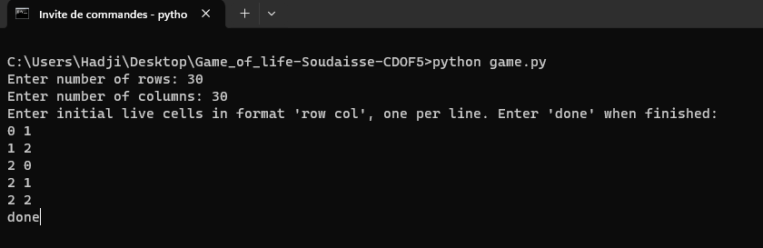
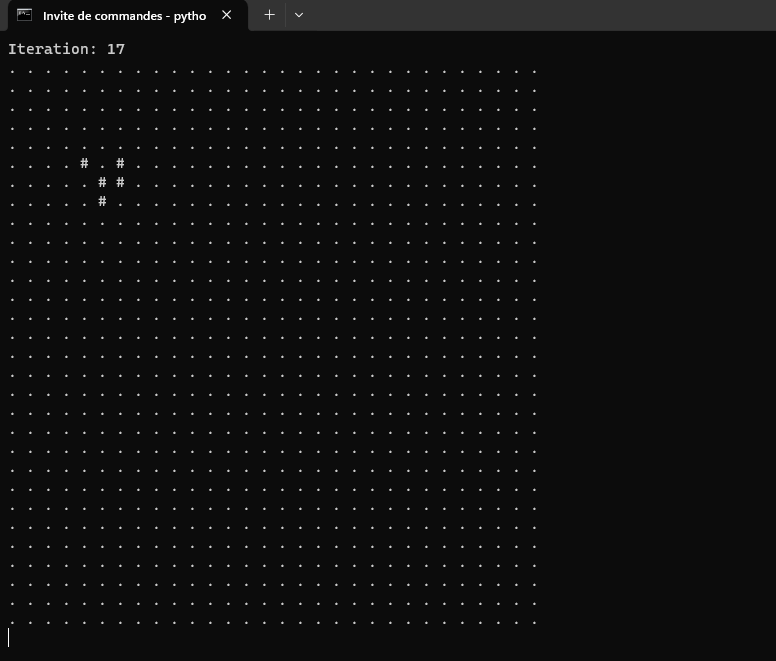

Game of Life - Une Implémentation Python
Histoire du Jeu :
Le "Game of Life" est un automate cellulaire créé par le mathématicien britannique John Horton Conway en 1970. Ce jeu est devenu célèbre pour sa capacité à simuler des systèmes complexes à partir de règles simples. Il est reconnu comme un exemple classique de la théorie des systèmes dynamiques et a fasciné les mathématiciens, les scientifiques, et les amateurs de jeux pour sa représentation de l'évolution et des patterns émergents.

Règles et Fonctionnement :
Le jeu se déroule sur une grille de cellules carrées qui, à chaque étape, peuvent être vivantes ou mortes. L'état de chaque cellule à l'étape suivante est déterminé par un ensemble de règles simples basées sur le nombre de voisins vivants :

Naissance : Une cellule morte avec exactement 3 voisins vivants devient vivante.
Survie : Une cellule vivante avec 2 ou 3 voisins vivants reste vivante.
Mort : Dans tous les autres cas, une cellule meurt ou reste morte.
À Propos de Cette Implémentation :
Cette version du "Game of Life" est une implémentation en Python utilisable via la ligne de commande. Elle permet à l'utilisateur de définir la taille de la grille et de positionner les cellules vivantes initiales. Voici comment cela fonctionne :

L'utilisateur est invité à saisir la taille de la grille (nombre de lignes et de colonnes).
Ensuite, l'utilisateur entre les coordonnées des cellules vivantes initiales.
Le jeu commence, affichant l'évolution de la grille à chaque itération.
Images d'Utilisation :
alt text
Voici un exemple d'utilisation.

